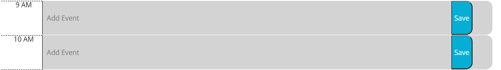

# 05 local storage: work day scheduler

This project is about using local storage and moment.js to create a day planner that tells you the date and saves events.

## Technologies used
- HTML
- CSS
- JavaScript
- the Moment.js library
- Bootstrap
- Jquery

[Website](https://sammyk118.github.io/work-day-scheduler/)

## Features

- a form, and a button to locally save that form for each hour in a workday



```javascript
$(".saveBtn").on("click", function () {
    var currId = $(this).parent().attr("id");
    var eventInf = $("input").val().trim();

    localStorage.setItem(currId, eventInf);
    // console.log(currId, eventInf);
    // console.log(eventInf);
})
```

- the calendar renders each time slot relative to the current time

```javascript
function pastFuture() {
    currHour = moment().hours();
    console.log("current hour: ", currHour);
    $(".time-block").each(function(){
        var calHour = $(this).attr("id");

        if (calHour < currHour) {
            //each class has a different background-color
            $(this).addClass("past")
        }
        else if (calHour > currHour) {
            $(this).addClass("future");
        }
        else {
            $(this).addClass("present");
        }
    })
```
## Author

**Sammy Kroner**

[LinkedIn](www.linkedin.com/in/samuel-kroner-44aa11169)

[GitHub](https://github.com/sammyk118)

## Acknowledgements
Credit to resources telling me about jquery's .each() function